# CGRA 2020/2021

| Name             | Number    | E-Mail             |
| ---------------- | --------- | ------------------ |
| Bruno Rosendo    | ---- | ---- |
| Henrique Sousa   | ---- | ---- |

----

## Project Notes

- For the fish's body texture, we used the following [image](https://www.publicdomainpictures.net/pt/view-image.php?image=283612&picture=fundo-de-padrao-de-escalas-de-peixe).

- For the pillars' texture, we used the following [image](https://snappygoat.com/s/?q=bestof%3Atrunk+tree+wood+nature+tree+bark+bark+texture+branch).

- We added an extra skybox (mountain), using the following [cube map](https://www.nicepng.com/ourpic/u2q8o0t4i1w7q8y3_desert-skybox-texture-png/).

- Regarding the water surface (exercise 5.2), instead of moving the image without taking the position of the pier into considerantion, we vary the texture's position slightly so it's always close to it, resulting in a more realistic scene.

- For exercise 5.4, we created an extra class, MyPier, representing a set of MyPillars. Additionally, we created a class, MyFlora, representing the population of the scene (algaes, nest, etc). The objects are generated randomly, within certain limits.

- For exercise 7, we created an extra class, MyAlgaeFormation, which creates algaes, randomly, in a small radius. We also made an improved shader for the fish's texture and auto autonomous moving fishs.

----

## Screenshots

<figure>
  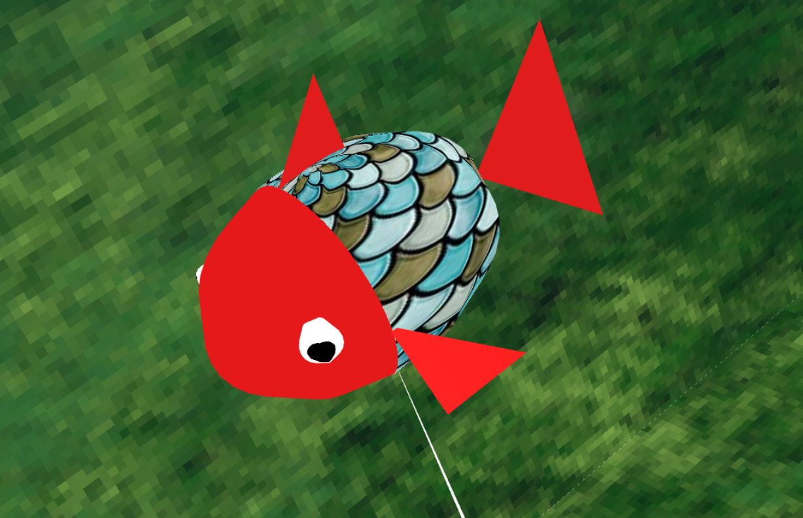
  <figcaption>Exercise 4 - MyFish</figcaption>
</figure>

<figure>
  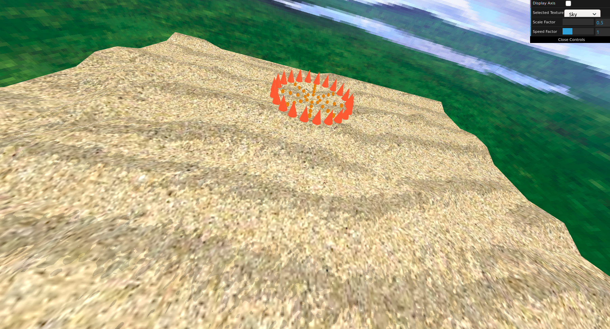
  <figcaption>Exercise 5.1 - MyNest</figcaption>
</figure>

<figure>
  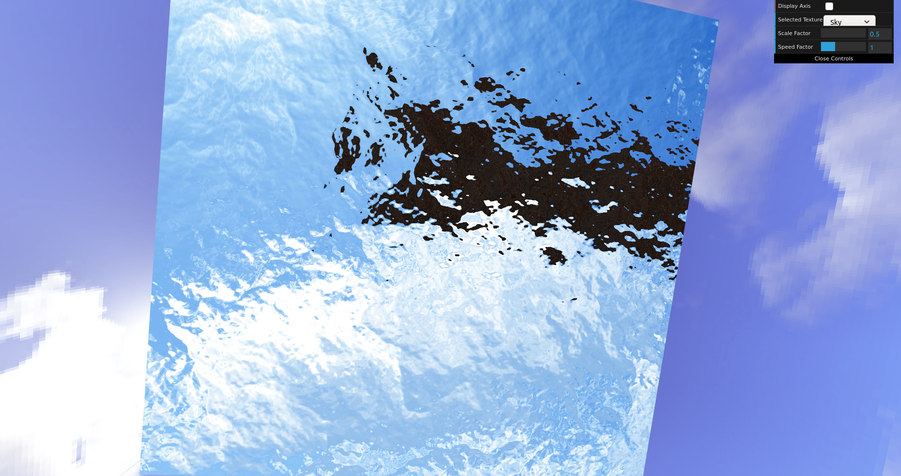
  <figcaption>Exercise 5.2 - Water Surface</figcaption>
</figure>

<figure>
  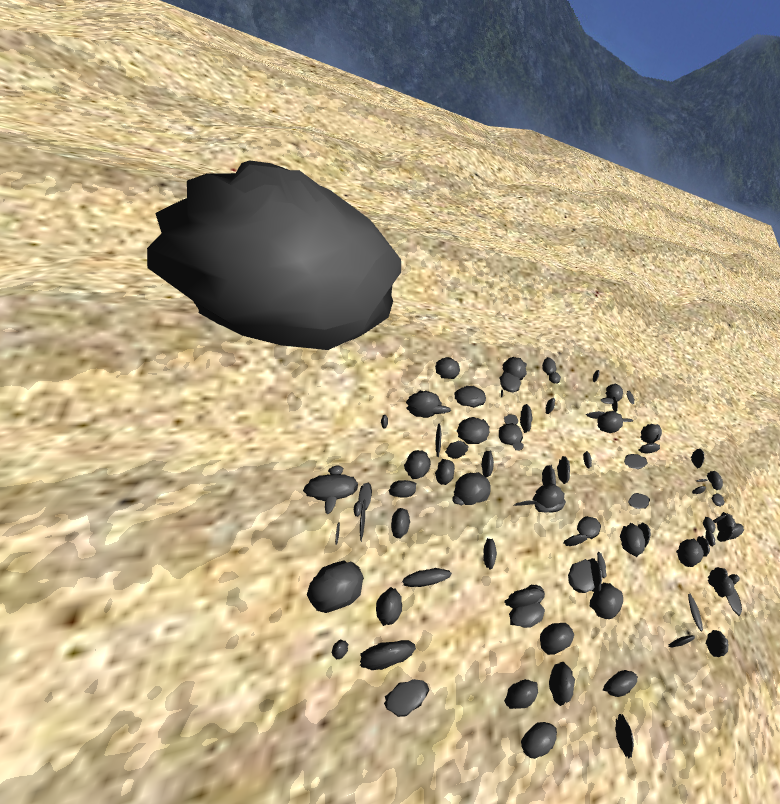
  <figcaption>Exercise 5.3 - MyRock and MyRockSet</figcaption>
</figure>

<figure>
  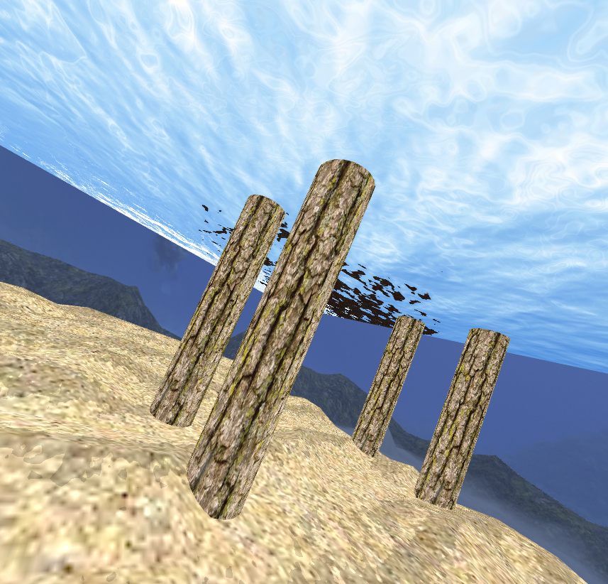
  <figcaption>Exercise 5.4 - MyPiller and MyPier</figcaption>
</figure>

<figure>
  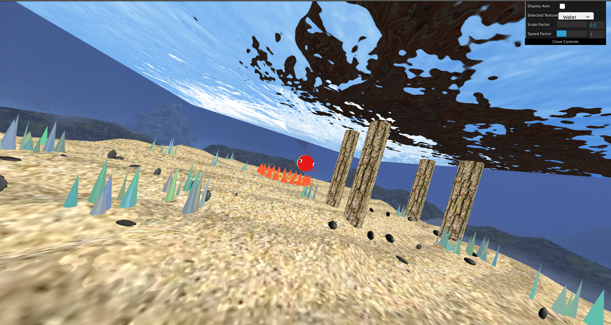
  <figcaption>Exercise 5.4 - Other Elements</figcaption>
</figure>

<figure>
  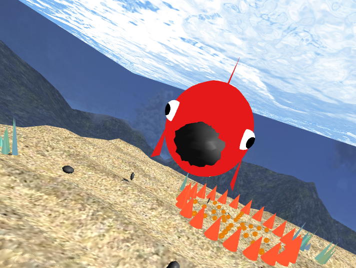
  <figcaption>Exercise 6 - Transporting Stones</figcaption>
</figure>

<figure>
  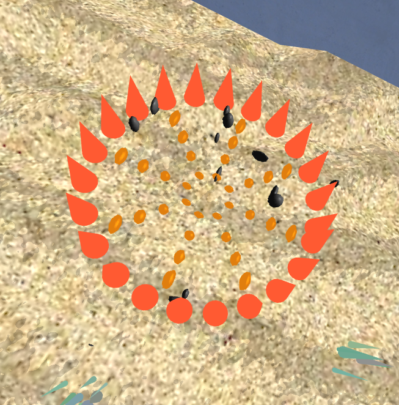
  <figcaption>Exercise 6 - Stones Left in the Nest</figcaption>
</figure>

<figure>
  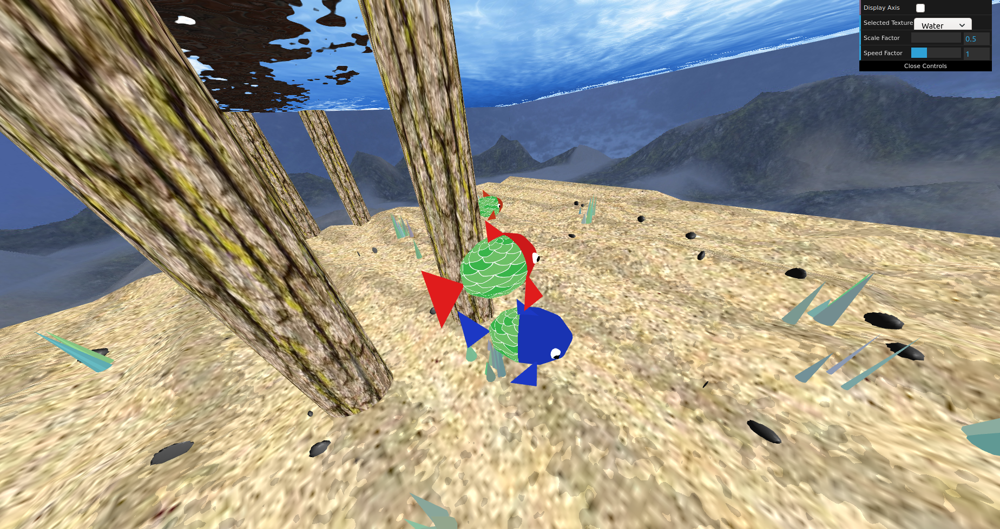
  <figcaption>Exercise 7 - MyAnimatedFish</figcaption>
</figure>

<figure>
  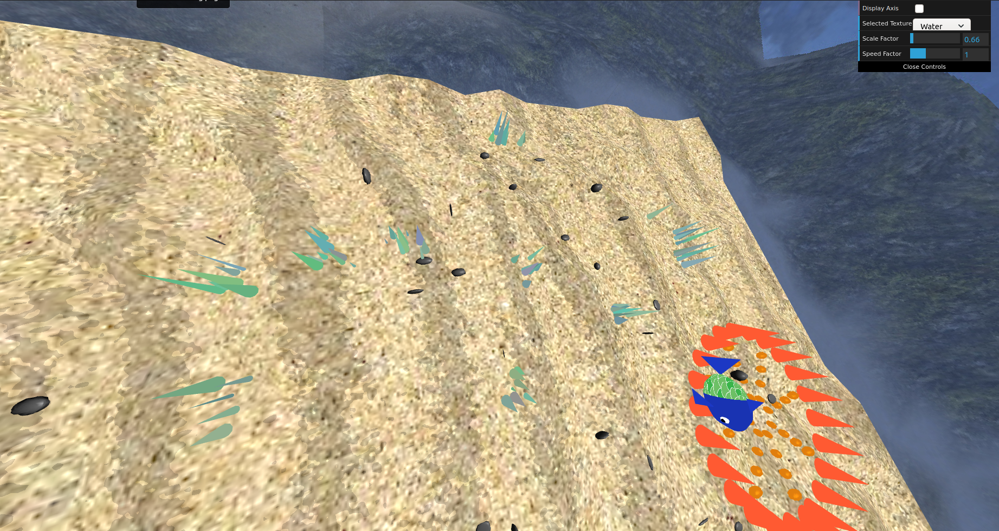
  <figcaption>Exercise 7 - Random Algaes</figcaption>
</figure>

<figure>
  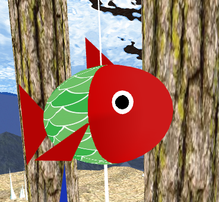
  <figcaption>Exercise 7 - Improved Fish Shader</figcaption>
</figure>
